# Strategic Credit Card Customer Segmentation

An end-to-end unsupervised learning pipeline to group credit card holders into distinct, actionable customer personas. This project analyzes the transaction history and card usage of **8,950 active credit card holders** over a 6-month period, compares four major clustering algorithms, and provides tailored business recommendations for target marketing.

---

## 📌 Project Overview
For financial institutions, understanding credit card usage behavior is key to optimizing credit limits, minimizing defaults, and running high-ROI marketing campaigns. This pipeline implements a robust unsupervised learning workflow:
1. **Exploratory Data Analysis (EDA)** to inspect distributions, multicollinearity, and outliers.
2. **Preprocessing**: Missing value imputation, variance stabilization via $\log(x+1)$, and standardization.
3. **Dimensionality Reduction (PCA)** to address multicollinearity and project variables into orthogonal components.
4. **Clustering Benchmarking**: Comparison of K-Means, DBSCAN, Agglomerative Hierarchical, and Spectral Clustering.
5. **Customer Persona Profiling**: Quantitative and qualitative breakdowns of segments with tailored business strategies.

---

## 📊 Exploratory Data Analysis (EDA)

### 1. Behavioral Feature Distributions
Core financial columns (`BALANCE`, `PURCHASES`, `CASH_ADVANCE`) are heavily right-skewed with long tails. A small portion of "power users" carry extreme balances or spend high volumes.
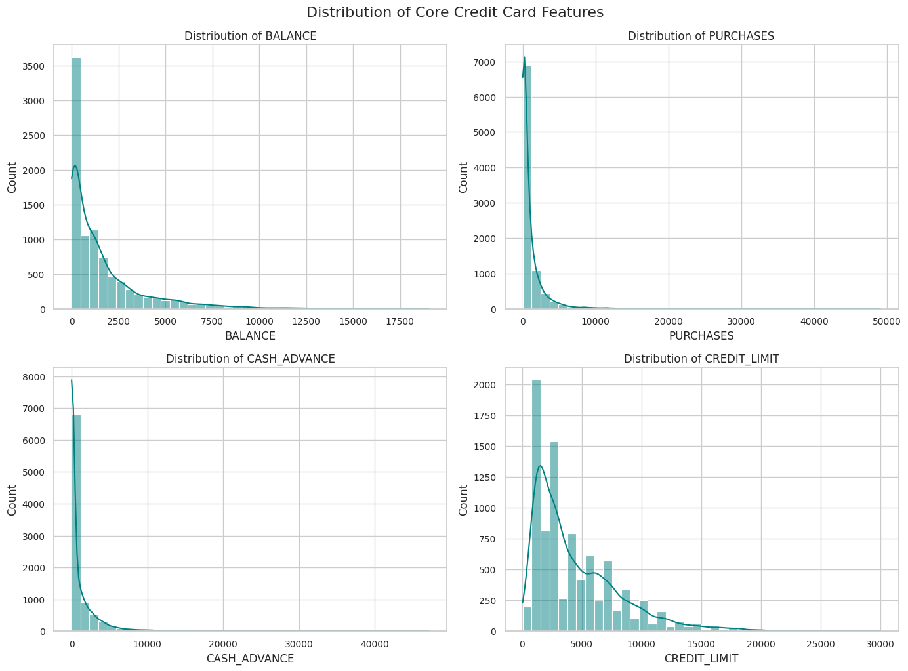

### 2. Correlation & Multicollinearity
Strong correlation exists between purchases and their components (`ONEOFF_PURCHASES` and `INSTALLMENTS_PURCHASES`), as well as cash advances and transaction frequencies. This highlights redundant information, justifying dimensionality reduction.
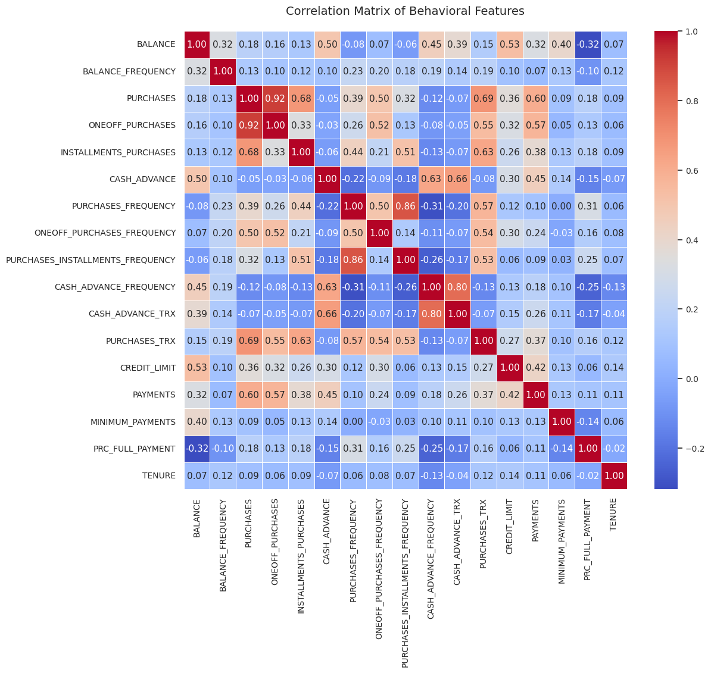

### 3. Outlier Identification
Boxplot analysis highlights substantial outlier points across balance, purchase volume, cash advance, and credit limit. Distance-based metrics are highly sensitive to these scale disparities, requiring standard scaling and log transformations.
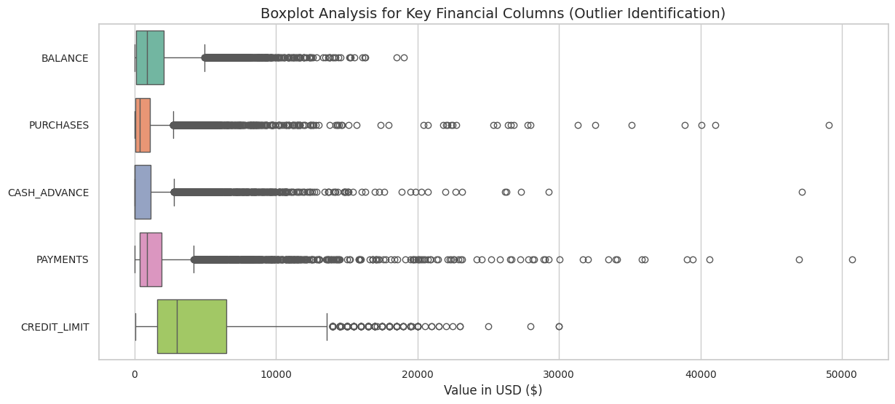

---

## ⚙️ Preprocessing & PCA

### Data Preparation Steps
* **Median Imputation**: Null values in `MINIMUM_PAYMENTS` (~3.5%) and `CREDIT_LIMIT` are imputed using column medians, preventing skew from extreme spenders.
* **Log Transformation**: Applied $f(x) = \log(x + 1)$ to stabilize variance and compress right-hand skewness.
* **Standardization**: Features normalized to zero mean and unit variance ($z = \frac{x - \mu}{\sigma}$) to prevent high-value features (e.g., credit limits) from dominating frequency variables.

### Dimensionality Reduction (PCA)
* **Scree Plot**: The first 2 principal components explain **51.77%** of the total variance, while 5 components capture **80.36%**.
* **Correlation Circle**: Projects variables onto PC1 (Purchase Volume & Activity) and PC2 (Borrowing & Cash Advance Tendency).
<p align="center">
  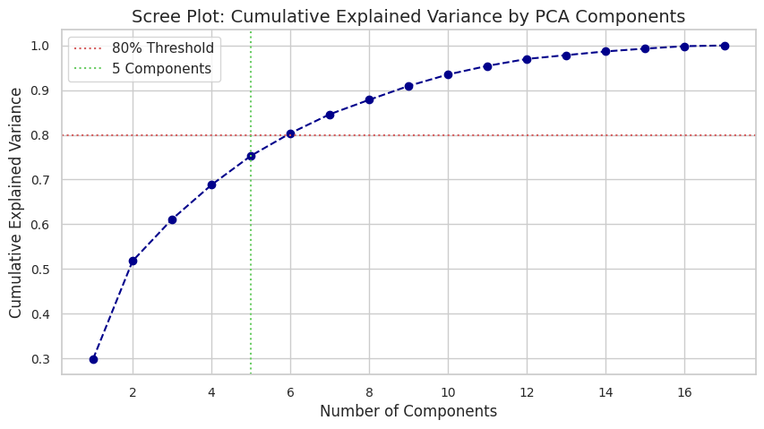
  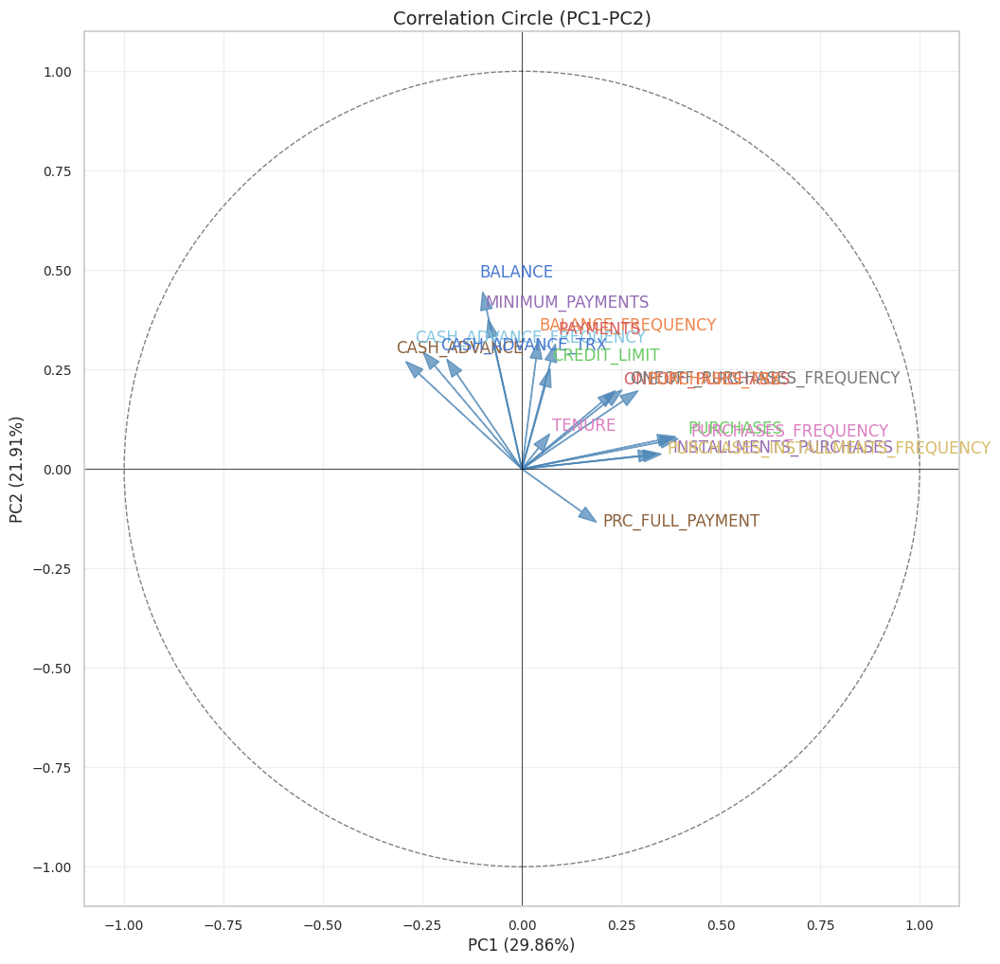
</p>

---

## 🏆 Clustering Algorithms Comparison

We compared four clustering algorithms on the 2D PCA space:

### 1. K-Means Clustering
* **Method**: Inertia and Silhouette optimization curves (for $K=2$ to $K=7$).
* **Selection**: While $K=2$ has the highest Silhouette Score (0.221), **$K=3$ (Silhouette 0.210)** is selected as it yields much more actionable, granular customer personas.
<p align="center">
  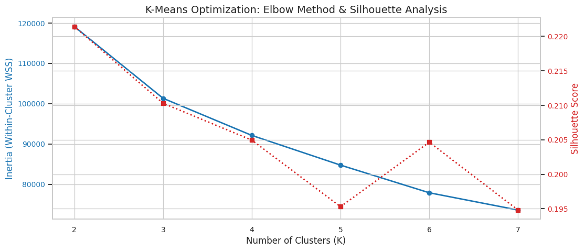
  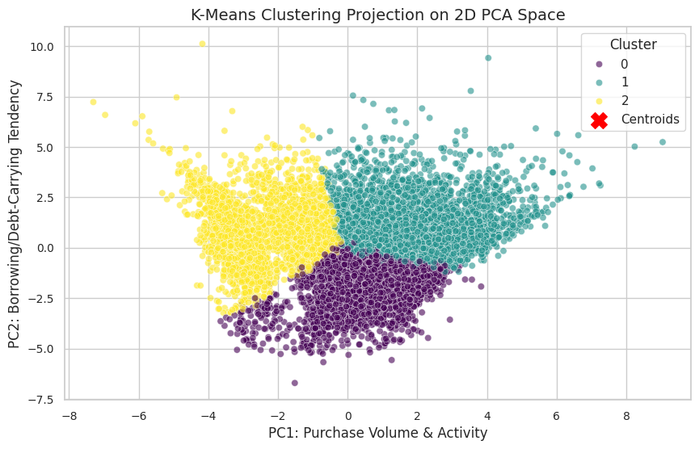
</p>

---

### 2. DBSCAN
* **Method**: Density-based clustering with $Eps = 2.0$ and $Min\_Samples = 10$.
* **Analysis**: Classifies the majority of users into a single core cluster, separating a small group of cash-advance users, while marking 542 records (~6%) as outliers/noise. Not ideal for a complete market segmentation.
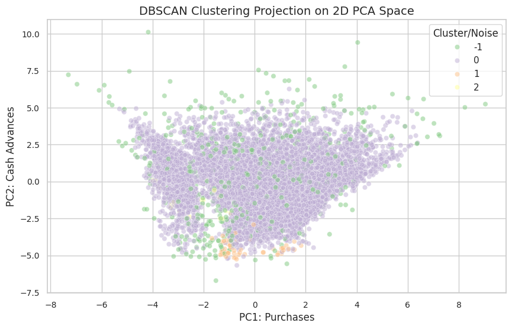

---

### 3. Agglomerative Hierarchical Clustering
* **Method**: Ward linkage (minimizes within-cluster variance) visualized on a 300-sample representative subset.
* **Analysis**: Agglomerative clustering with $K=3$ produces cluster boundaries very similar to K-Means.
<p align="center">
  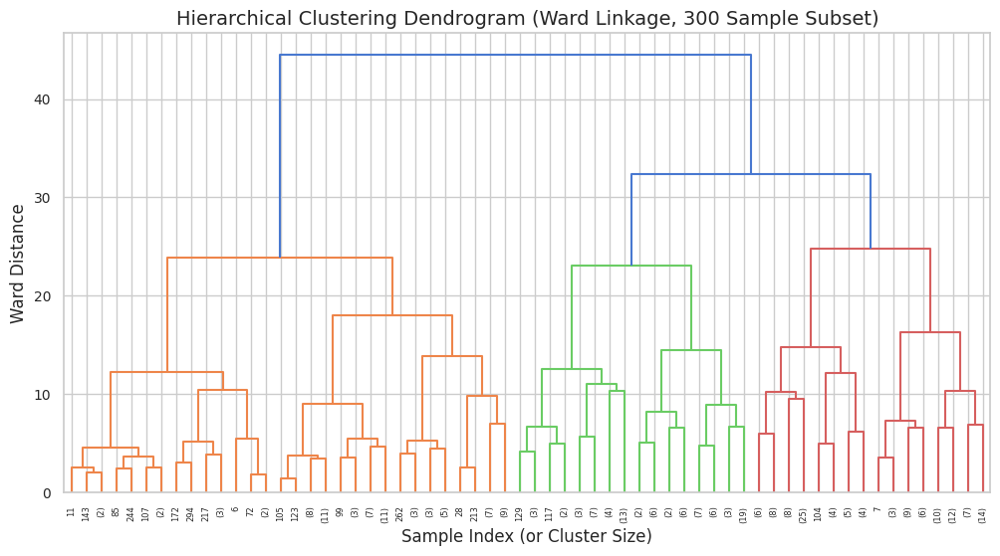
  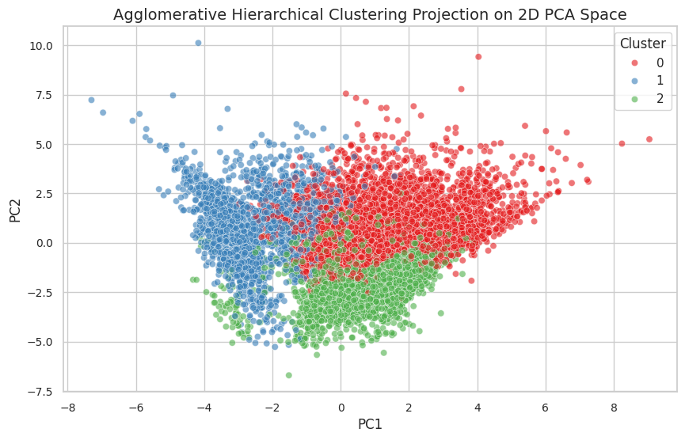
</p>

---

### 4. Spectral Clustering
* **Method**: Affinity graph laplacian projection computed on a sample of 2,000 customers.
* **Analysis**: Captures non-convex patterns well, but has an $O(N^3)$ computational complexity, making it non-viable for massive transaction databases.
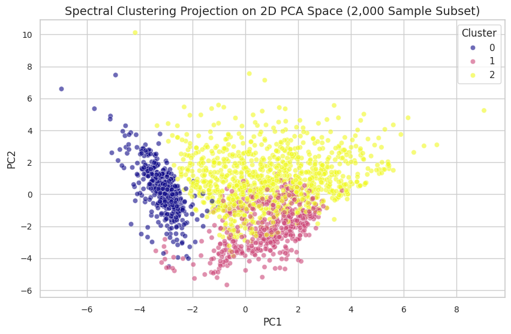

---

## 📈 Model Comparison Matrix

| Model | Silhouette Score | Number of Clusters | Noise Points | Complexity | Production Suitability |
| :--- | :---: | :---: | :---: | :---: | :---: |
| **K-Means (K=3)** | **0.2103** | **3** | **0** | **$O(N)$** | **Highly Recommended (Primary)** |
| **Agglomerative (Ward, K=3)** | 0.1828 | 3 | 0 | $O(N^2)$ | Moderate (Slow for large databases) |
| **DBSCAN (Eps=2.0, Min=10)** | 0.1540 | 3 | 542 | $O(N \log N)$ | Low (Lumps most users in one cluster) |
| **Spectral Clustering (K=3)** | 0.1737 | 3 | 0 | $O(N^3)$ | Low (Extremely resource-heavy) |

---

## 👥 Customer Personas & Marketing Strategies

Based on the chosen **K-Means (K=3)** model, cardholders are segmented into three distinct behavior patterns:

### Cluster Profile Metrics (Means)

| Metric | Cluster 0: Transactors | Cluster 1: VIP Shoppers | Cluster 2: Borrowers |
| :--- | :---: | :---: | :---: |
| **Active Customers** | 2,847 (31.8%) | 3,043 (34.0%) | 3,060 (34.2%) |
| **Average Balance** | $195.87 | $2,018.75 | $2,386.06 |
| **Average Purchases** | $463.49 | $2,373.43 | $142.74 |
| **Cash Advance** | $55.19 | $700.57 | $2,115.02 |
| **Credit Limit** | $3,274.70 | $5,820.56 | $4,310.15 |
| **Payments** | $684.96 | $2,658.60 | $1,788.05 |
| **Purchases Frequency** | 53.1% | 85.1% | 9.4% |
| **Cash Advance Freq** | 1.3% | 9.4% | 28.9% |
| **Full Payment Rate** | 27.2% | 16.8% | 3.0% |

---

### 👤 Persona Breakdown

#### 🟢 Cluster 0: The Transactors (Active, Low-Balance)
* **Behavior**: Low balances ($\approx$\$196), frequent small/medium purchases, and the highest rate of paying off their statement in full (27.2%). They rarely use cash advances.
* **Marketing Strategy**: 
  * Promote **Cashback and Reward Points** for daily shopping (groceries, dining) to increase transaction volume.
  * Partner with merchants for discount offers.

#### 🔵 Cluster 1: The VIP Shoppers (High Spenders)
* **Behavior**: Highest purchase volumes ($\approx$\$2,373), high credit limits ($\approx$\$5,820), and highly frequent card activity (85.1% purchase frequency). They use a mix of one-off and installment purchases.
* **Marketing Strategy**:
  * Offer **Co-branded premium cards** with travel perks, lounge access, or high-tier reward multipliers.
  * Provide **installment interest-free financing options** (0% APR) on high-ticket purchases to encourage even higher spend.

#### 🔴 Cluster 2: The Borrowers (Cash-Advance Seekers)
* **Behavior**: High balances ($\approx$\$2,386) but extremely low purchase activity. Instead, they use the card primarily for cash advances ($\approx$\$2,115 average cash advance) and carry over debt month-to-month, rarely paying in full (3.0%).
* **Marketing Strategy**:
  * Focus on **balance transfer promotions** or structured personal loan conversion offers to secure interest income.
  * Provide financial wellness reminders and debt consolidation alerts to manage default risk.

---

## 🛠️ Requirements & Setup

To run this notebook, install the following packages:
```bash
pip install pandas numpy scikit-learn matplotlib seaborn scipy
```

1. Clone or download this project.
2. Ensure `CC GENERAL.csv` is in the same directory.
3. Open `customer_segmentation.ipynb` in Jupyter Notebook/JupyterLab and run all cells.
